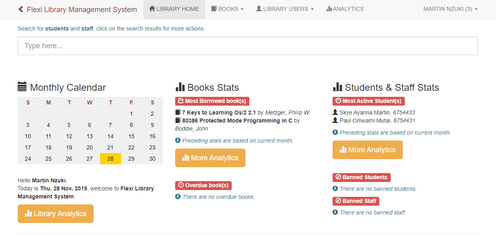

# flexi-library-management-system
A PHP Library Management System

***Warning!** This project was last updated way back in 2015. Don't frown if it dissapoints you :)*

---

### Installation
1. Set-up the project on your local server.
2. Import the database from `flexi.sql`.
3. Modify the `conn.php` file with your database connection details.
4. Run on your browser.
5. When asked for a **activation key**, use:
    
    `8AA9-EA1A-43C9-4613`

5. Use **martinnzuki** as username and **flexi_lms_15** as your password to login.

